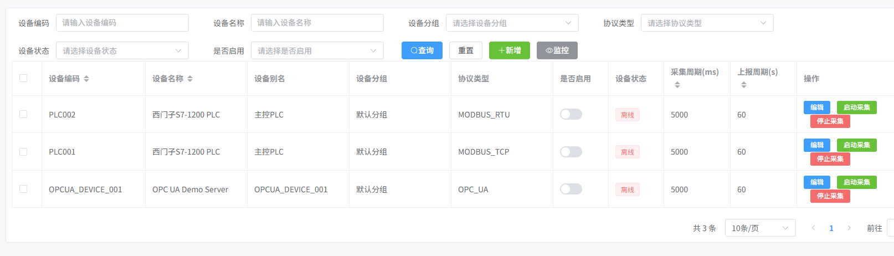
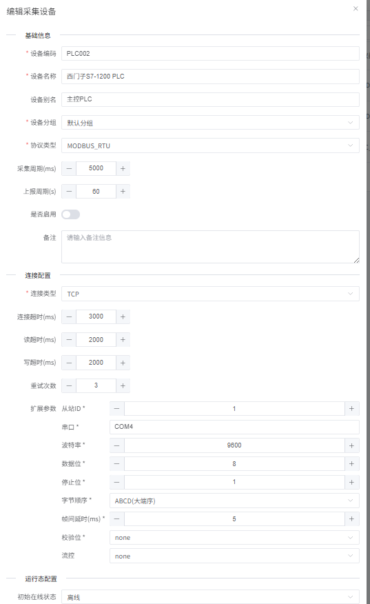
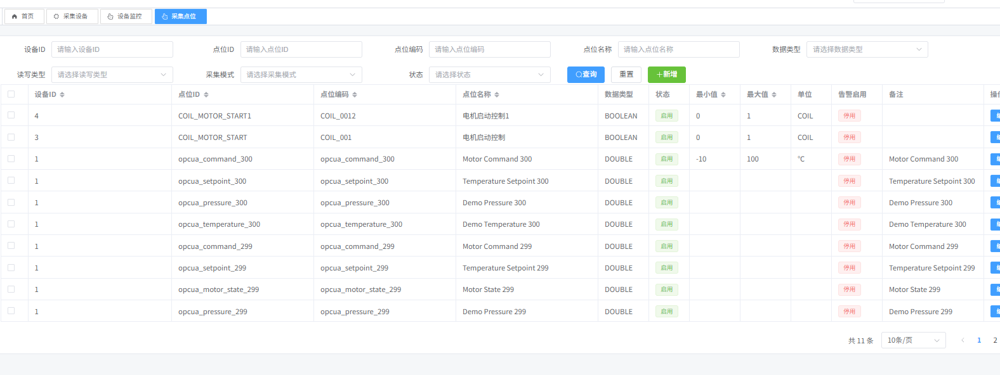
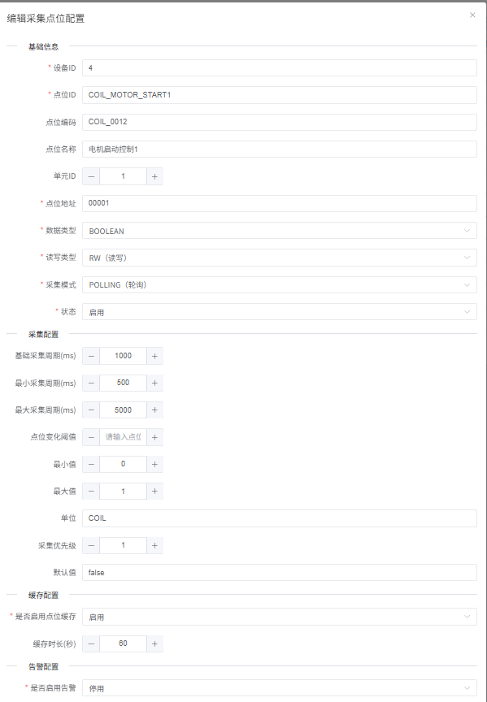
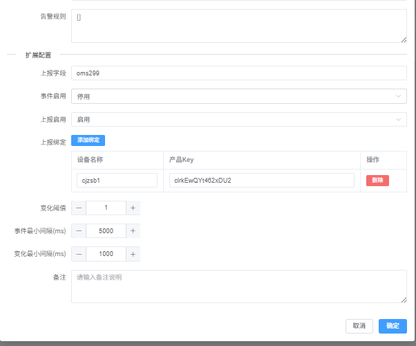
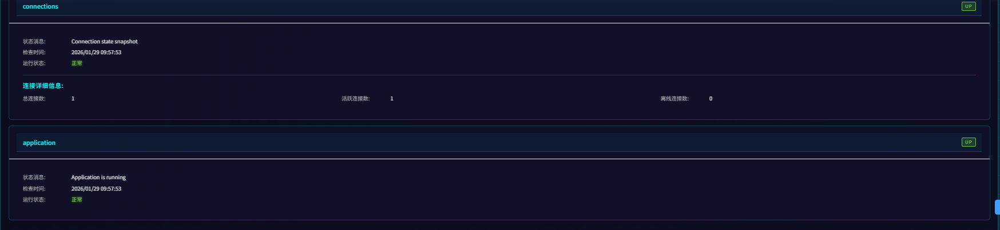
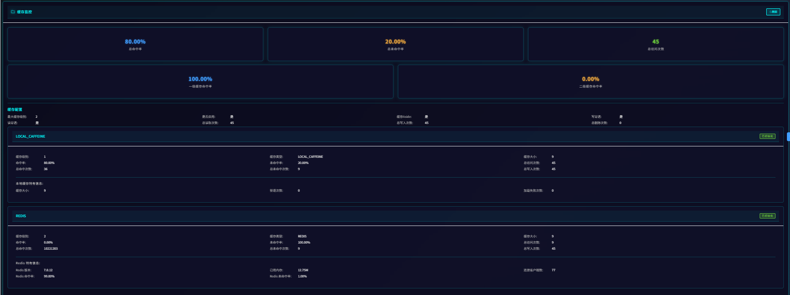
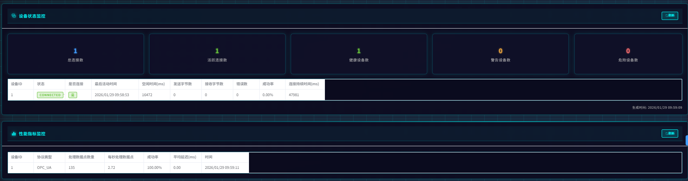
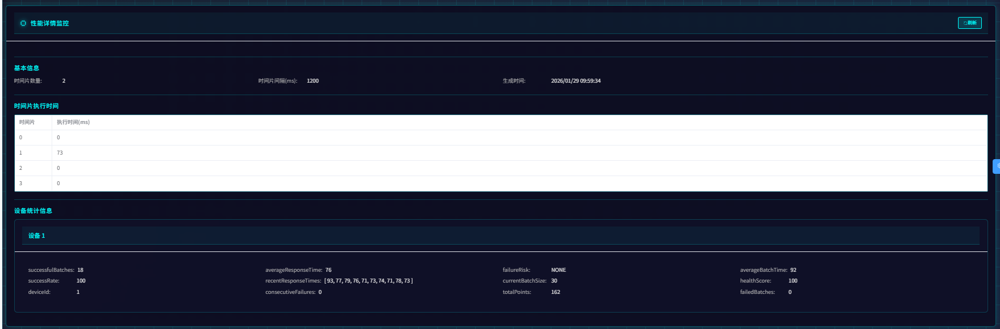
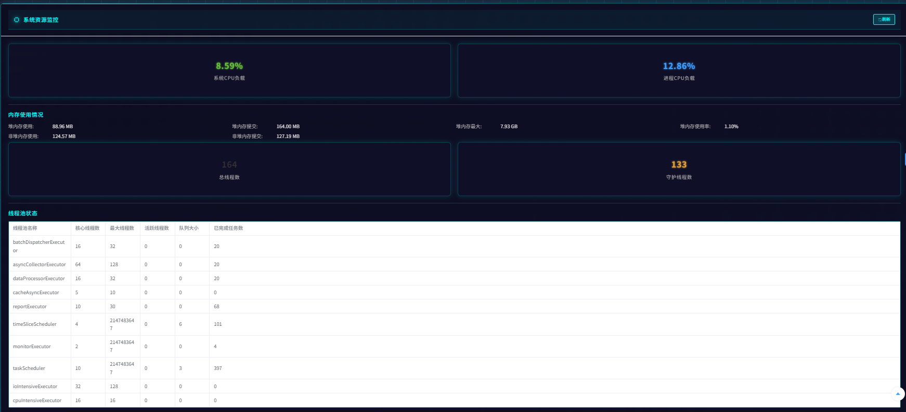

物联网采集系统前端

---

### 1️⃣ 采集前端（IoT 管理与监控界面）

**项目名称：wangbin-iot-vue3**

- 基于 **Vue 3 + TypeScript** 构建
- 提供设备管理、点位配置、采集状态监控、数据展示等功能
- 作为采集系统与后端服务的统一管理入口

**Gitee：**  
https://gitee.com/wangbinlx/wangbin-iot-vue3

**GitHub：**  
https://github.com/wangbin777/wangbin-iot-vue3

---

### 2️⃣ 采集服务（工业数据采集网关）

**项目名称：data-collection-service**

- 基于 **Java / Spring Boot** 开发
- 用于对接各类工业设备与协议（如 Modbus 等）
- 负责数据采集、处理、转换，并将纵向采集数据转化为横向结构数据
- 支持将采集结果定期上报至云端后端服务

**Gitee：**  
https://gitee.com/wangbinlx/data-collection-service

**GitHub：**  
https://github.com/wangbin777/data-collection-service

---

### 3️⃣ 后端服务（IoT 云平台 / 管理后台）

**项目名称：wangbin-iot-cloud**

- 基于 **Java / Spring Boot / 微服务架构**
- 负责设备、数据、用户、权限等核心业务管理
- 提供统一 API 接口，供前端与采集服务调用
- 支撑采集数据的存储、分析与业务处理

**Gitee：**  
https://gitee.com/wangbinlx/wangbin-iot-cloud

**GitHub：**  
https://github.com/wangbin777/wangbin-iot-cloud

---

## 整体架构关系

```text
┌────────────────────┐
│  wangbin-iot-vue3  │  ← 采集前端（Vue3）
└─────────▲──────────┘
          │ API
┌─────────┴──────────┐
│ wangbin-iot-cloud  │  ← 后端服务（云平台）
└─────────▲──────────┘
          │ 数据上报
┌─────────┴──────────┐
│ data-collection-   │
│ service            │  ← 采集服务（工业网关）
└────────────────────┘
```











